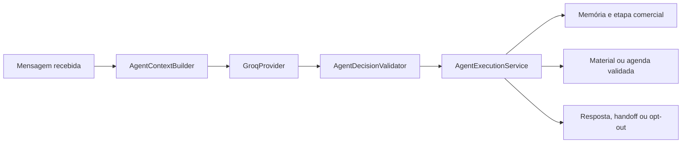

# Francisco e GroqCloud

## Decisão de provedor

Francisco usa exclusivamente a GroqCloud pelo pacote oficial `groq-sdk`. Não existe fallback para OpenRouter, OpenAI API, Anthropic, Gemini, xAI ou outro provedor. A aplicação usa `llama-3.3-70b-versatile` como seleção inicial quando esse modelo aparece na lista ativa da conta e `whisper-large-v3-turbo` para transcrição quando disponível.

O `GroqProvider` concentra cinco operações: listar modelos da conta, validar a chave, gerar a decisão estruturada, transcrever áudio e verificar saúde. Requisições não têm retry interno; essa responsabilidade pertence à fila persistente.

## Configuração segura

1. Abra **Integrações > GroqCloud**.
2. Informe a chave, valide e escolha um modelo de chat e um modelo Whisper retornados pela própria conta.
3. Salve e execute o teste de resposta.

A chave é criptografada com AES-256-GCM antes de entrar em `app_settings`/`system_settings`. A API e a interface só devolvem a versão mascarada. `ENCRYPTION_KEY` deve ser um segredo forte e estável em produção; trocar esse valor invalida segredos já armazenados.

Se o modelo selecionado deixar de aparecer em `models.list()`, a IA é pausada, a seleção principal é limpa e o painel pede uma nova escolha. Não há troca silenciosa de modelo nem de provedor.

## Fluxo de execução

Responsabilidades:

- `AgentContextBuilder`: seleciona histórico, conhecimento, memória, materiais e horários dentro do orçamento de contexto, e trata texto do lead como dado não confiável.
- `KnowledgeService`: seleciona apenas conhecimento comercial relevante.
- `ConversationMemoryService`: mantém memória estruturada com evidência `explicit`, `inference` ou `hypothesis`.
- `SalesStageService`: protege estados terminais e resolve transições.
- `MaterialRecommendationService`: só escolhe material ativo, permitido, aderente e ainda não enviado.
- `AppointmentTool`: só confirma um horário que exista exatamente na agenda disponível.
- `HandoffTool`: transfere decisões de baixa confiança.
- `AgentDecisionValidator`: aplica todas as proteções antes de qualquer efeito externo.
- `AgentExecutionService`: orquestra contexto, Groq e validação.

## Decisão estruturada

A Groq responde em JSON mode e o resultado é validado localmente com Zod. A decisão inclui resposta, etapa, intenção, sentimento, atualização de resumo, memória/evidência, perguntas, objeções, material, demonstração, agendamento, handoff, opt-out, follow-up, confiança e justificativa operacional curta. O sistema nunca armazena chain-of-thought.

## Rate limit e falhas

- Os cabeçalhos `x-ratelimit-*` e `retry-after` são lidos e apresentados no painel.
- Em `429`, o job volta para a fila no instante indicado por `Retry-After`; não é enviado em duplicidade e não troca de provedor.
- Modelo removido pausa a IA e gera alerta persistente.
- Chave inválida, seleção inválida e falhas recentes aparecem no diagnóstico da integração.

## Opt-out e takeover

O classificador local de opt-out exige expressões explícitas; um simples “não” ou “não quero demonstração agora” não bloqueia o contato. Em uma solicitação válida, Francisco envia uma única confirmação curta e a função `apply_lead_opt_out` registra a supressão, fecha a conversa e cancela follow-ups e filas pendentes sob lock transacional.

Quando um humano assume a conversa, `human_active`, pausa ou bloqueio impedem resposta, material, agenda e follow-up da IA. A automação só pode voltar depois da devolução explícita para Francisco.

## Validação

A suíte `francisco.test.ts` cobre 23 cenários comerciais e de segurança, incluindo modelo removido, áudio no Whisper e parsing de 429. A API também testa que chave em texto puro e valor criptografado nunca aparecem nas respostas.
